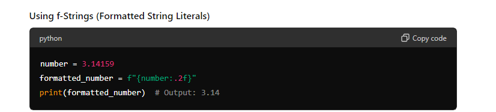

# python-challenge-1
## By Peter Vitello

Using the knowledge gained from ChatGPT and Stack Overflow, I learned how to format rounding to the nearest decimal place. This is important for USD prices. The format ":.2f" rounds to 2 decimal places as I only know how to do this in C based languages. 

I was also having trouble with the formatting of the string. ChatGPT was not able to solve it, so in the code, I added 2 extra spaces between {price_spaces} and the | separator.  print(f"{item_name}{item_spaces}|-${item_price:.2f}{price_spaces}--|-{item_quant}{quant_spaces}"). These extra spaces fixed my issue ("-" represents a space)